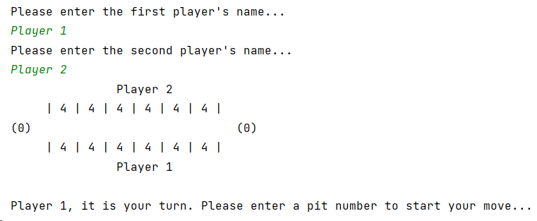
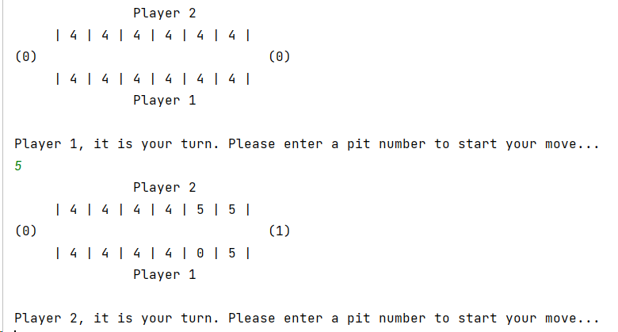

# Mancala Game

This project is an implementation of the Mancala game using Java where console input/output is used to interact with the players.

## Running the project

- Clone this repository in IntelliJ.
- Run the "Game" class in the "core" package.

## Gameplay

- The players are initially asked to choose their names which will be used throughout the gameplay.
- After choosing player names, the first player will be asked to make the first move by specifying a pit number (as shown below).

- As shown above, it is assumed that each player starts with **6** pits (each containing **4** seeds) + an empty large pit.
- Players are only allowed to specify valid pit numbers between 1 and 6.
- After specifying a valid pit number, the move will be executed (see example below) and then it will be decided who plays next and so on.

- In the above move, "Player 1" selected pit 5 which resulted in the following actions:
    - "Player 1": Pit 5 was cleared (4 seeds were picked-up).
    - "Player 1": One seed was added to pit 6.
    - "Player 1": One seed was added to the large pit.
    - "Player 2": One seed was added to pit 1.
    - "Player 2": One seed was added to pit 2.

- The game ends when a player runs out of seeds in his/her 6 pits. In this case, the winner is declared which is the one having more seeds in his/her large pit (or the game ends in a draw if both players have the same seeds count in their large pits).